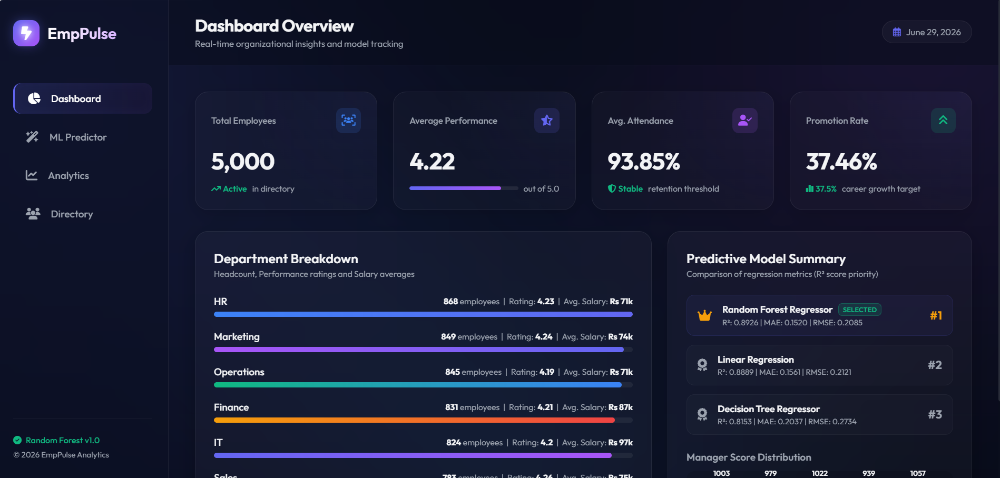
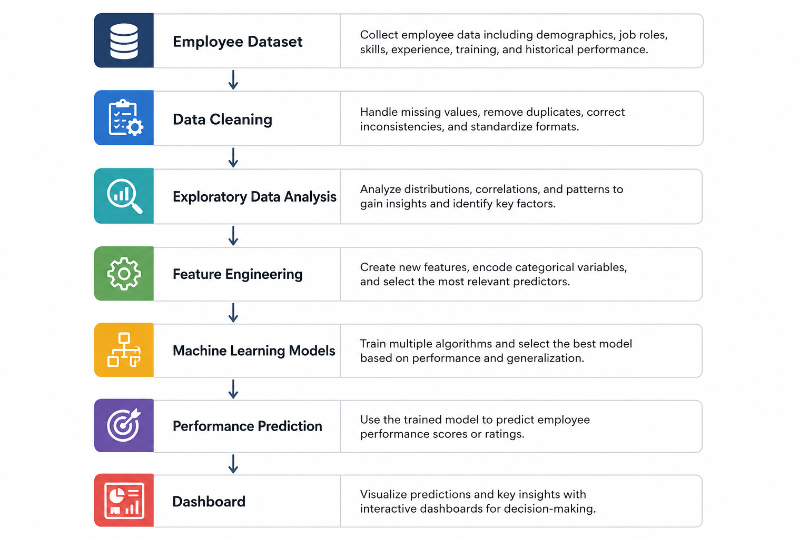
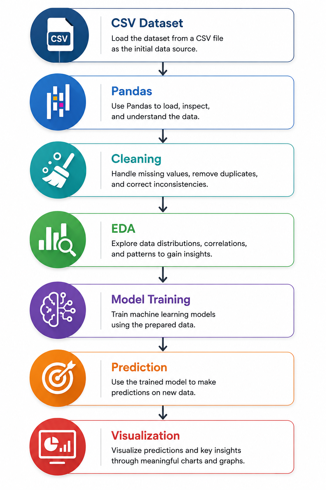

# 🚀 EmpPulse

Employee Performance Analytics and Prediction System using Machine Learning.

---

## 📌 Overview

EmpPulse is an Employee Performance Analytics System that helps organizations analyze employee performance and predict future performance using Machine Learning.

---

## ✨ Features

- Employee Performance Analysis
- Data Cleaning
- Exploratory Data Analysis
- Machine Learning Prediction
- Dashboard
- Performance Reports

---

## 🛠 Tech Stack

- Python
- Flask
- Pandas
- NumPy
- Scikit-Learn
- Matplotlib
- Seaborn
- SQL

---

## 🧠 Machine Learning Models

- Random Forest Regressor ✅
- Linear Regression
- Decision Tree Regressor

---

## 📊 Model Performance

| Model | R² | MAE | RMSE |
|------|------|------|------|
| Random Forest | 0.8926 | 0.1520 | 0.2085 |
| Linear Regression | 0.8889 | 0.1561 | 0.2121 |
| Decision Tree | 0.8153 | 0.2037 | 0.2734 |

---

## 📷 Dashboard



---

## 🏗 Architecture



---

## 🔄 Workflow



---

## 📂 Installation

```bash
git clone https://github.com/ashay1817/EmpPulse.git

cd EmpPulse

pip install -r requirements.txt

python src/app.py
```

---

## 👨‍💻 Author

Ashay Mane
